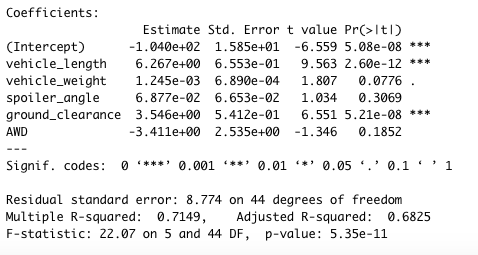
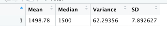
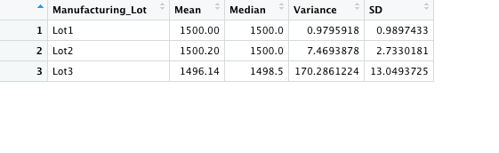
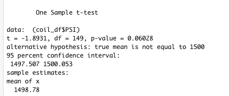
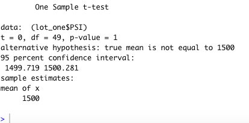
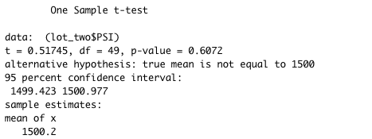
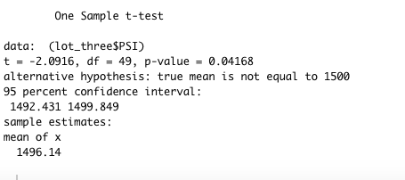

# MechaCar_Statistical_Analysis
## Linear Regression to Predict MPG
* The two variables that provided a non-random amount of variance to the mpg values in the dataset were ground clearance and vehicle length because they had a p-value under 0.05%.
* The slope of the linear model is not considered to be 0 because non of the slopes under estimate are 0.
* The linear model predicts mpg of MechaCar prototypes effectively with a .7149 R-squared score which is pretty solid. The p-value is also much lower than 0.05, which indicates the model is strong.

## Summary Statistics on Suspension Coils
* The design specifications for the MechaCar suspension coils dictate that the variance of the suspension coils must not exceed 100 pounds per square inch. 
* In our report, it shows that the variance is 170.29 pounds per square inch, which exceeds the 100 mark. 
* In total, the variance is good, and in lot 1 and 2 the variance is good as well.

## T-Tests on Suspension Coils
* These 4 pictures below are the results of the t-test for All the lots, lot 1, lot 2, and lot 3.
* Lot 3 is the only lot that is statistically different from the 1500 mean. This is because the p-value for lot 3 is under .05.

## Study Design: MechaCar vs Competition
* An idea for a study would be to see the mean of MPG for MechaCar versus the competition.
* The null hypothesis would be there is no statistical difference between average MPG for MechaCar and the competition.
* The alternative hypothesis would be there is a statistical difference between average MPG for MechaCar and the competition.
* To test this, I would use a two sample t-test. This would allow us to see the t value and if it is low enough to confirm a statistical difference between the two.
* I would make a subset of MechaCar to get the mean of the MechaCar MPG and another subset getting the mean of MPG for the competition.